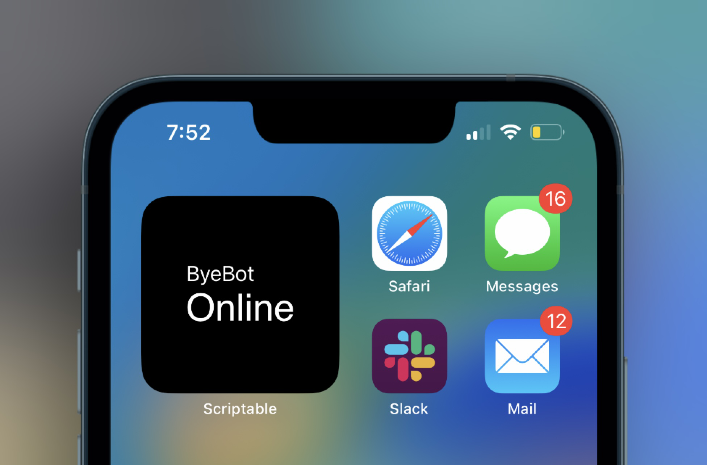

# Scriptables

A collection of scripts for the [Scriptable](https://scriptable.com) iOS app. Install instructions are on the script's page.

*Jump to script*

- [Uptime](#uptime)

## Uptime

[Full page ->](uptime/index.md)

Uptime is a widget for your home screen. It tells you if a website is up or not.
